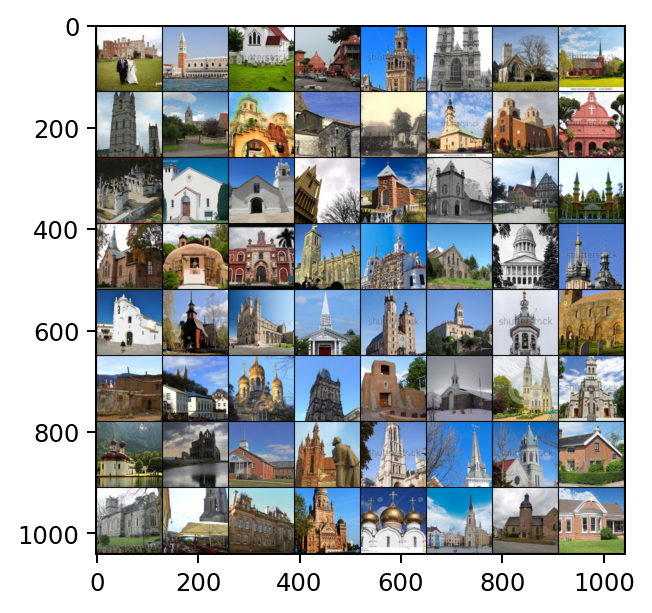
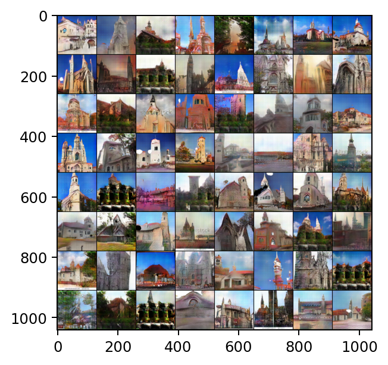
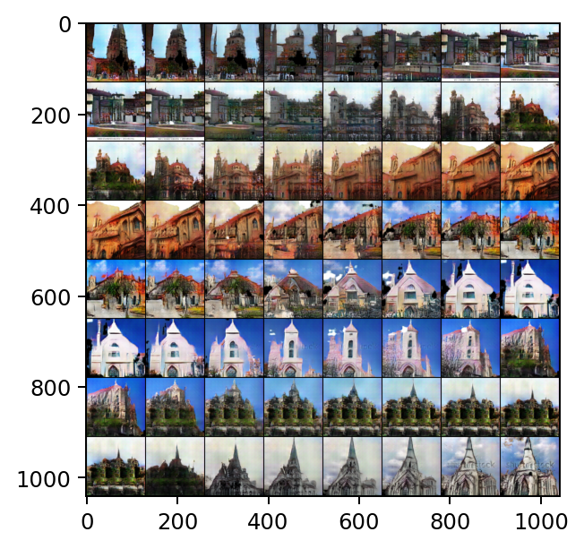

### DCGAN with PyTorch on LSUN Church Dataset (128x128)
This exploration utilizes Deep Convolutional Generative Adversarial Networks (DCGANs) and trains them on the LSUN Church dataset to generate synthetic, realistic images. The project experiments with modified DCGAN architecture to suit the dataset requirements, focusing on generating images with a resolution of 128x128.

### Introduction
This project implements the training of a DCGAN on the LSUN Church dataset using PyTorch to understand the ability of GANs in generating high-quality, diverse, and realistic images. The chosen dataset is visually complex, aiding in a thorough evaluation of the model's capabilities.

### Requirements
- Python 3.7+
- PyTorch (with torchvision)
- Numpy & Matplotlib
- Jupyter environment (Google Colab recommended)
- LSUN Dataset

### Usage
1. Open the Jupyter Notebook on Google Colab.
2. Ensure the LSUN dataset is placed in the 'drive/My Drive/' directory or update the path accordingly.
3. Run the cells in sequence.

### Methodology
The notebook incorporates an adapted DCGAN architecture, modifying the number of channels, filters, and input/output dimensions according to the LSUN Church dataset. The generator employs a series of transpose convolutional layers, batch normalization, and ReLU activation functions to upscale input noise vectors and generate high-resolution images. The discriminator, designed to differentiate between real and generated samples, utilizes convolutional layers and leaky ReLU activation functions.

The model is trained using the Adam optimizer, a learning rate of 0.0002, and a batch size of 128. It undergoes training for 100 epochs. The training procedure employs the binary cross-entropy loss function to compute losses and update the model’s parameters effectively.

### Results
The initial results demonstrate that the model can separate foreground and background and recognize different objects in the generated images after being trained for 100 epochs. The model shows the capability to generate diverse samples with unique patterns and shapes, providing smooth transitions in the latent space between various church architectures.

**Real Images from the LSUN Church Dataset:**

*Sample training images from the LSUN Church dataset at 128x128 resolution.*

**Images Generated by the DCGAN Model:**

*Generated images by the DCGAN model after training on the LSUN Church dataset.*

*Images generated through interpolation in the latent space, showcasing the DCGAN's ability to capture smooth transitions.*

